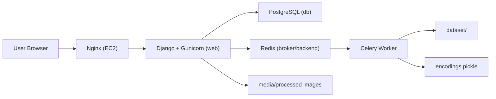

# SmartRoll

SmartRoll is a facial-recognition attendance system built with Django.
It supports async face-encoding jobs using Celery + Redis and runs as a
Dockerized multi-service stack.

## Stack

- Python, Django
- OpenCV + `face_recognition` (dlib)
- Celery + Redis
- PostgreSQL
- Docker, Docker Compose
- AWS EC2 + Nginx (deployment)

## Architecture

- `web`: Django + Gunicorn HTTP app
- `worker`: Celery worker for background encoding rebuilds
- `db`: PostgreSQL
- `redis`: queue broker/result backend

## Quick Start (Local)

### 1) Clone

```bash
git clone https://github.com/Pranav188/SmartRoll.git
cd SmartRoll
```

### 2) Configure `.env`

Create `.env` in project root:

```env
POSTGRES_DB=smartroll_db
POSTGRES_USER=smartroll_user
POSTGRES_PASSWORD=password123
DATABASE_URL=postgres://smartroll_user:password123@db:5432/smartroll_db
CELERY_BROKER_URL=redis://redis:6379/0
CELERY_RESULT_BACKEND=redis://redis:6379/0
SECRET_KEY=dev_secret_key
DEBUG=True
ALLOWED_HOSTS=.localhost,127.0.0.1,0.0.0.0
```

### 3) Start services

```bash
docker compose up -d --build
```

### 4) Initialize DB (first run)

```bash
docker compose exec web python manage.py migrate
docker compose exec web python manage.py loaddata datadump.json
docker compose exec web python manage.py createsuperuser
```

### 5) Open app

`http://localhost:8000`

## Common Commands

```bash
docker compose ps
docker compose logs web --tail=100
docker compose down
```

## Performance Notes

Benchmark (A/B) on `/students/add/` comparing:

- `sync`: rebuild face encodings inside request thread
- `async`: enqueue rebuild via Celery (`.delay()`)

Observed results (local benchmark):

- Async mean: `4.79 ms` (p50: `2.35 ms`)
- Sync mean: `11658.52 ms` (p50: `11643.23 ms`)
- Reduction: `99.96%` mean, `99.98%` p50

Reproduce:

```bash
./.venv/bin/python benchmark_async_latency.py
```

## Architecture Diagram



## Deployment (EC2)

High-level flow:

1. Launch Ubuntu EC2 and configure Security Group (`22`, `80`, `443`).
2. Install Docker + Compose plugin.
3. Clone repo, create production `.env`, run `docker compose up -d`.
4. Put Nginx in front of Gunicorn (`127.0.0.1:8000`).
5. Point domain/Elastic IP and optionally add HTTPS via Certbot.

## Screenshots

- `screenshots/home.png`
- `screenshots/add_student.png`
- `screenshots/student_list.png`

## License

MIT
